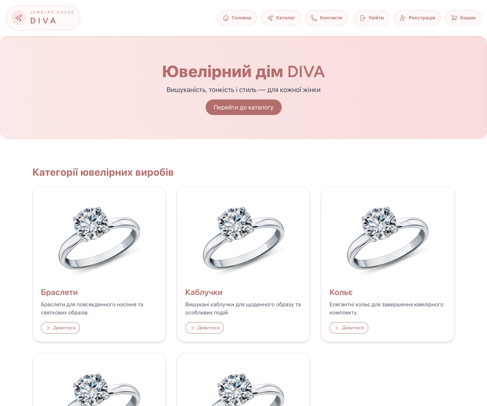
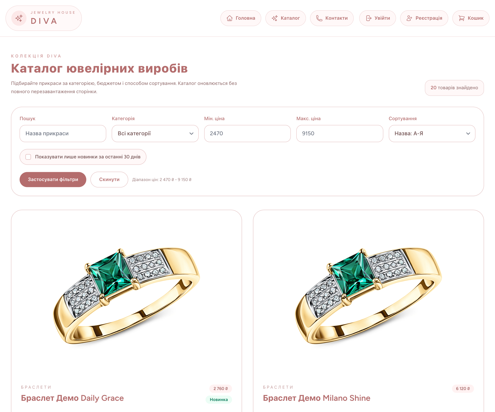
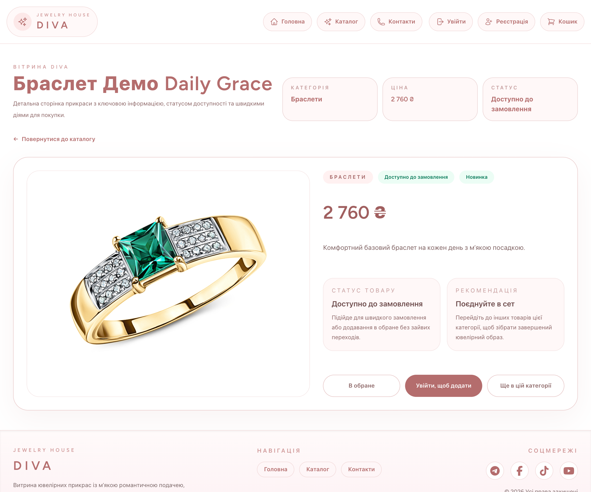
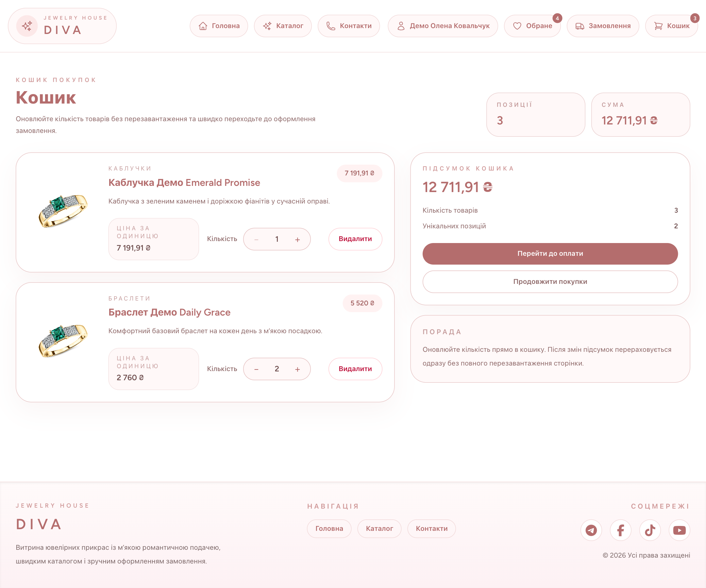
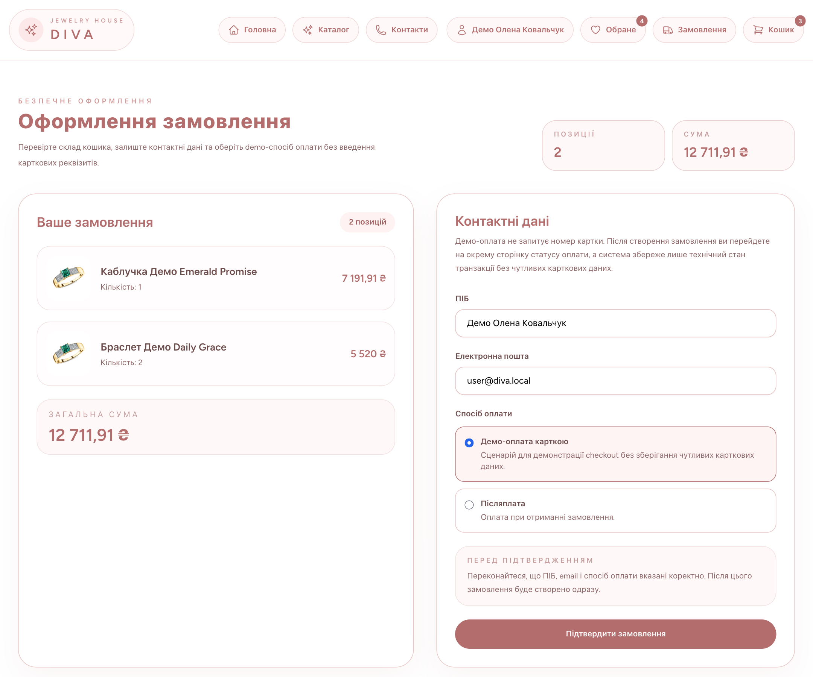
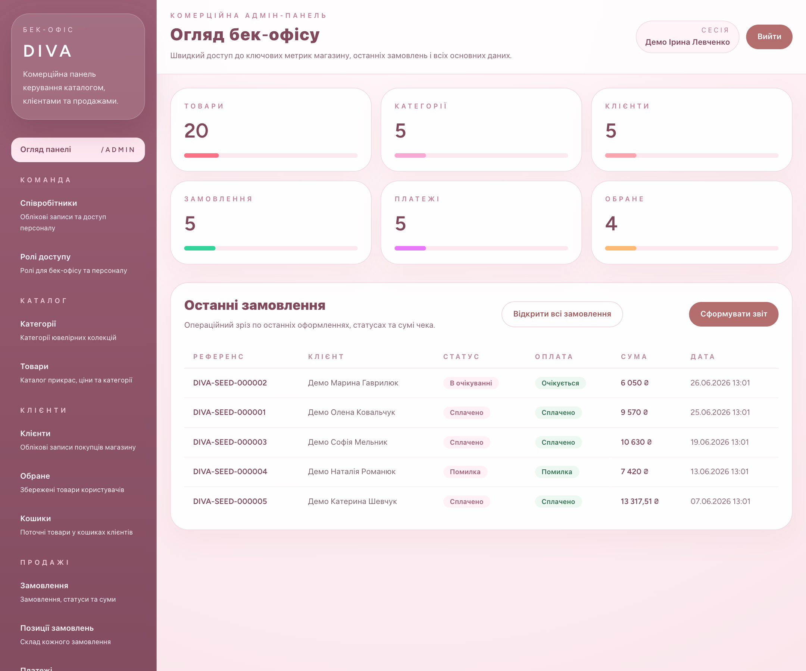

# Diva Jewelry

Laravel 10 + Inertia.js + Vue 3 storefront for a jewelry shop with a customer-facing catalog, cart and checkout flow, plus a separate backoffice for catalog, customer, order and payment operations.

## What is inside

- storefront with category landing, catalog, product page, favorites, cart and checkout
- auth flows for customers
- order history and payment status pages
- MoonShine-based backoffice with dashboard and resource management
- Docker-based local runtime with MySQL, Redis, PHP-FPM, Nginx and Vite

## Screenshots

| Home | Catalog |
| --- | --- |
|  |  |

| Product | Cart |
| --- | --- |
|  |  |

| Checkout | Admin Dashboard |
| --- | --- |
|  |  |

## Stack

- PHP 8.1 / Laravel 10
- Vue 3 / Inertia.js / Vite / Tailwind CSS
- MySQL 8
- Redis 7
- MoonShine admin panel

## Quick Start

```bash
docker compose up --build -d
docker compose exec -T app php artisan db:seed --force
```

Open:

- storefront: `http://localhost`
- admin login: `http://localhost/admin/login`
- Vite HMR: `http://localhost:5173`
- live: `http://localhost/live`
- ready: `http://localhost/ready`
- metrics: `http://localhost/metrics`

## Demo Accounts

Storefront user:

- email: `user@diva.local`
- password: `user12345`

Backoffice user:

- email: `admin@diva.local`
- password: `admin12345`

## Useful Commands

Run backend tests:

```bash
docker compose exec -T app php artisan test
```

Run frontend production build:

```bash
docker compose exec -T vite npm run build
```

Stop the stack:

```bash
docker compose down
```

## Services

- `web`: Nginx entrypoint for the application
- `app`: Laravel application on PHP-FPM
- `vite`: frontend dev server with HMR
- `db`: MySQL database
- `redis`: cache, session and queue backend

## Project Layout

- `app/Http/Controllers` - HTTP entrypoints
- `app/Services` - business logic
- `app/MoonShine` - admin resources
- `resources/js` - Inertia pages and Vue components
- `database/migrations` - schema
- `database/seeders` - demo data
- `tests` - feature and unit tests
- `docs/screenshots` - project screenshots used in this README
